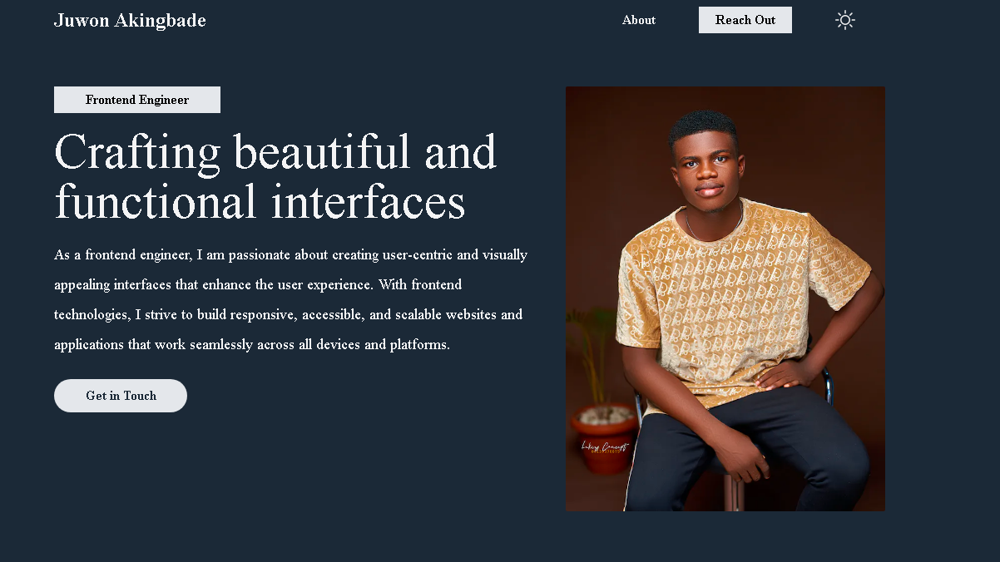

 <h1 align="center" style="border-bottom: 1px solid gray;">Personal Portfolio</h1>

<p align='center'>This project is solely built to showcase my works and skills.</p>

<h2 align='center'>
<a href='https://juwon-akingbade.vercel.app' > Demo</a>
</h2>

<h2 style="border-bottom: 1px solid gray;">Table of Contents</h2>
<ul>
    <li><a href="#overview">Overview</a></li>
    <li><a href='#builtwith'>Built with</a></li>
    <li><a href ='#feature'>Features</a></li>
    <li><a href="#howtouse">How to use</a></li>
</ul>

<h1 id='overview'>Overview</h1>
 <nr/>

<h1 id='builtwith'>Built with</h1>
<li>Next Js</li>
<li>Tailwind Css</li>  <br />


<h1 id='feature'>Feature</h1>
<li>Theming</li>  <br />

<h1 id='howtouse'>How To Use</h1>

<p>
To clone and run this application, you'll need <a href='https://git-scm.com/'>Git</a> and <a href='https://nodejs.org/en/download/'>Node Js</a> (which comes with <a href='http://npmjs.com/'>npm</a>) installed on your computer. From your command line:
</p>

```
# Clone this repository
$ git clone https://github.com/your-user-name/your-project-name

# Install dependencies
$ yarn install

# Run the app
$ yarn start

```


